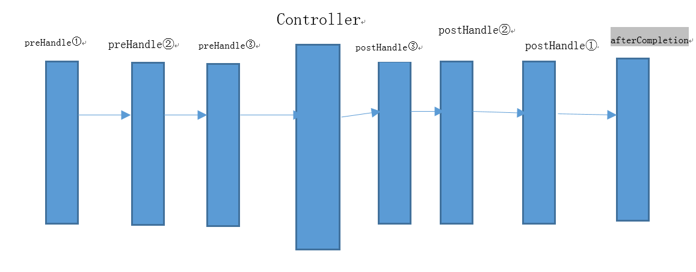

## SpringMVC拦截器原理图



?>SpringMVC默认拦截所有`能够到达`的请求

## 拦截器示例

```java
public class HelloInteceptor implements HandlerInterceptor {

    @Override
    public boolean preHandle(HttpServletRequest request, HttpServletResponse response, Object handler) throws Exception {

        return false;
    }

    @Override
    public void postHandle(HttpServletRequest request, HttpServletResponse response, Object handler, ModelAndView modelAndView) throws Exception {

    }

    @Override
    public void afterCompletion(HttpServletRequest request, HttpServletResponse response, Object handler, Exception ex) throws Exception {

    }
}
```

?>  preHandle()： 这个方法在业务处理器处理请求之前被调用，SpringMVC 中的Interceptor 是链式的调用的，在一个应用中或者说是在一个请求中可以同时存在多个Interceptor 。每个Interceptor 的调用会依据它的声明顺序依次执行，而且最先执行的都是Interceptor 中的preHandle 方法，所以可以在这个方法中进行一些前置初始化操作或者是对当前请求的一个预处理，也可以在这个方法中进行一些判断来决定请求是否要继续进行下去。该方法的返回值是布尔值Boolean 类型的，当它返回为false 时，表示请求结束，后续的Interceptor 和Controller 都不会再执行；当返回值为true 时就会继续调用下一个Interceptor 的preHandle 方法，如果已经是最后一个Interceptor 的时候就会是调用当前请求的Controller 方法。

 
?>     postHandle()：这个方法在当前请求进行处理之后，也就是Controller 方法调用之后执行，但是它会在DispatcherServlet 进行视图返回渲染之前被调用，所以我们可以在这个方法中对Controller 处理之后的ModelAndView 对象进行操作。postHandle 方法被调用的方向跟preHandle 是相反的，也就是说先声明的Interceptor 的postHandle 方法反而会后执行。

 
?>     afterCompletion()：该方法也是需要当前对应的Interceptor 的preHandle 方法的返回值为true 时才会执行。顾名思义，该方法将在整个请求结束之后，也就是在DispatcherServlet 渲染了对应的视图之后执行。这个方法的主要作用是用于进行资源清理工作的。

## 实际应用：
  
 ### 登录拦截器：

`首页访问及登录控制器`
 ```java
@RequestMapping("/")
public String hello(){
    return "index";
}

@RequestMapping("/login")
public String login(User user, HttpSession session){
    QueryWrapper<User> queryWrapper = new QueryWrapper<>();
    queryWrapper.eq("name",user.getName()).eq("password",user.getPassword());
    User user2 = userrService.getOne(queryWrapper);
    if(user2!=null){
        session.setAttribute("user",userr);
    }
    return "redirect:/";
}

@RequestMapping("/logout")
public String logout(HttpSession session){
    session.invalidate();
    return "redirect:/";
}
 ```

 `登录拦截器`
 ```java
public class LoginInteceptor implements HandlerInterceptor {
    @Override
    public boolean preHandle(HttpServletRequest request, HttpServletResponse response, Object handler) throws Exception {
        if(request.getSession().getAttribute("user")!=null){
            return true;
        }else{
            request.getRequestDispatcher("/WEB-INF/views/form.jsp").forward(request,response);
            return false;
        }
    }
    @Override
    public void postHandle(HttpServletRequest request, HttpServletResponse response, Object handler, ModelAndView modelAndView) throws Exception {

    }

    @Override
    public void afterCompletion(HttpServletRequest request, HttpServletResponse response, Object handler, Exception ex) throws Exception {
    }
}
 ```

 `配置`
 ```xml
<mvc:interceptors>
    <mvc:interceptor>
        <mvc:mapping path="/**"/>
        <mvc:exclude-mapping path="/login"/>
        <mvc:exclude-mapping path="/resources/**"/>
        <bean class="com.weixin.inteceptor.LoginInteceptor"/>
    </mvc:interceptor>
</mvc:interceptors>
 ```

 ### 请求记录拦截器
 ```java
public class ActionLogInterceptor implements HandlerInterceptor {
    private Logger logger = Logger.getLogger(ActionLogInterceptor.class);

    private long startTime = 0;
    private String url = null;
    private String viewName = null;
    private Date date = null;
    private DateFormat dateFormat = new SimpleDateFormat("yyyy-MM-dd HH:mm:ss S");
    @Override
    public boolean preHandle(HttpServletRequest request, HttpServletResponse httpServletResponse, Object handler) throws Exception {
        startTime = System.currentTimeMillis();
        date = new Date();

        url = request.getRequestURI();

        logger.debug("--------------------------action请求----------------------------:" + dateFormat.format(date));
        String str = "";
        if (handler != null) {
            str = handler.toString().trim();
            //去掉修饰符和参数
            int index = str.indexOf(" ");
            if (index != -1) str = str.substring(index, str.length() - 1).trim();
            index = str.indexOf(" ");
            if (index != -1) str = str.substring(index + 1, str.length() - 1).trim();
            index = str.indexOf("(");
            if (index != -1) str = str.substring(0, index).trim();
        }
        logger.debug("url: " + url);
        logger.debug("method: " + request.getMethod());
        logger.debug("调用方法：" + str);
        logger.debug("参数：");
        Map parameterMap = request.getParameterMap();
        for (Object key : parameterMap.keySet()) {
            String name = (String) key;
            String value = request.getParameter(name);
            logger.debug(name + " : " + value);
        }
        return true;
    }

    @Override
    public void postHandle(HttpServletRequest httpServletRequest, HttpServletResponse httpServletResponse, Object o, ModelAndView modelAndView) throws Exception {
        if (modelAndView != null)
            viewName = modelAndView.getViewName();
    }

    @Override
    public void afterCompletion(HttpServletRequest request, HttpServletResponse response, Object handler, Exception e) throws Exception {
        if (viewName != null) {
            logger.debug("viewName: " + viewName);
        }
        logger.debug("耗时：" + (System.currentTimeMillis() - startTime) + "毫秒");
        logger.debug("------------------------------------------------------: " + dateFormat.format(new Date())); 
    }
}
 ```
