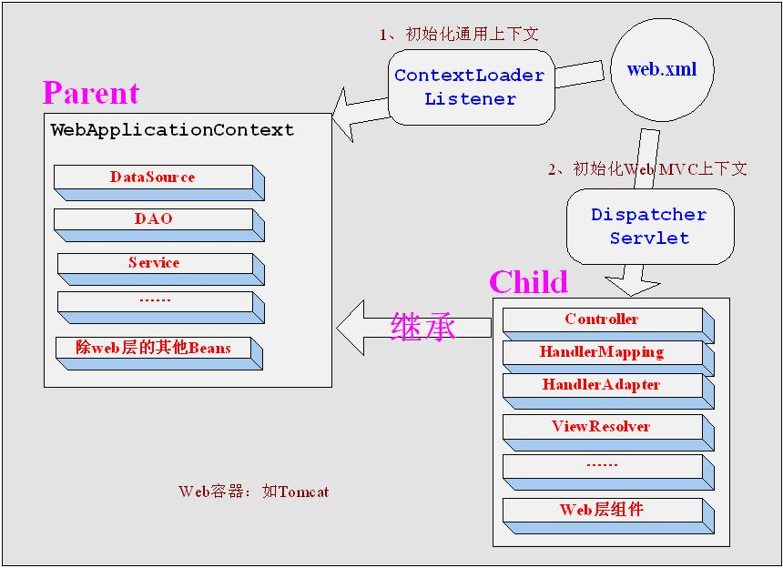

## 3个容器：

?>容器:管理对象的组件，如web容器管理servlet，filter，listener，也叫servlet容器

在SSM项目的框架整合，说白了就是3个容器得整合，`web容器`，`spring容器`，`springmvc容器`，再由spring容器去做其他整合扩展

spring容器我们之前需要靠new ClassPathXmlApplicationContext("applicationContext.xml")来启动

springmvc容器(用于管理控制器，拦截器等对象)的启动由DispatcherServlet完成，也就是说springmvc容器天生和web容器整合，随web容器的启动而启动

那么我们spring容器也由web容器启动不是挺好？

```xml
<?xml version="1.0" encoding="UTF-8"?>
<web-app version="3.0" xmlns="http://java.sun.com/xml/ns/javaee" xmlns:xsi="http://www.w3.org/2001/XMLSchema-instance"
         xsi:schemaLocation="http://java.sun.com/xml/ns/javaee http://java.sun.com/xml/ns/javaee/web-app_3_0.xsd">

    <!-- Spring监听器,  启动spring容器 -->
    <listener>
        <description>Spring监听器</description>
        <listener-class>org.springframework.web.context.ContextLoaderListener</listener-class>
    </listener>

    <!-- Spring MVC ，启动springmvc容器-->
    <servlet>
        <servlet-name>SpringMVC</servlet-name>
        <servlet-class>org.springframework.web.servlet.DispatcherServlet</servlet-class>
        <init-param>
            <description>SpringMVC</description>
            <param-name>contextConfigLocation</param-name>
            <param-value>classpath:spring/spring-mvc.xml</param-value>
        </init-param>
        <load-on-startup>1</load-on-startup>
    </servlet>
    <servlet-mapping>
        <servlet-name>SpringMVC</servlet-name>
        <url-pattern>/</url-pattern>
    </servlet-mapping>
</web-app>
```

## 整合模型：



?>web.xml 文件中的先后顺序无关。web容器维护对象的顺序是：context-param -> listener(spring) -> filter -> servlet(springmvc) 

导致容器的启动顺序为> web容器 > spring 容器 > springmvc容器  (父子容器)

子容器可以使用父容器的对象，反之不行


各容器应各司其职，否则引起混乱：
1. web容器：        `管理servlet，listener，filter`
2. spring容器：     `管理除了controller的普通bean，事务`   (spring扫描配置不要扫到controllerbean,controller可能失效)
3. springmvc容器：  `管理controller，拦截器`             (springmvc扫描配置不要扫到非controllerbean，事务可能失效)

